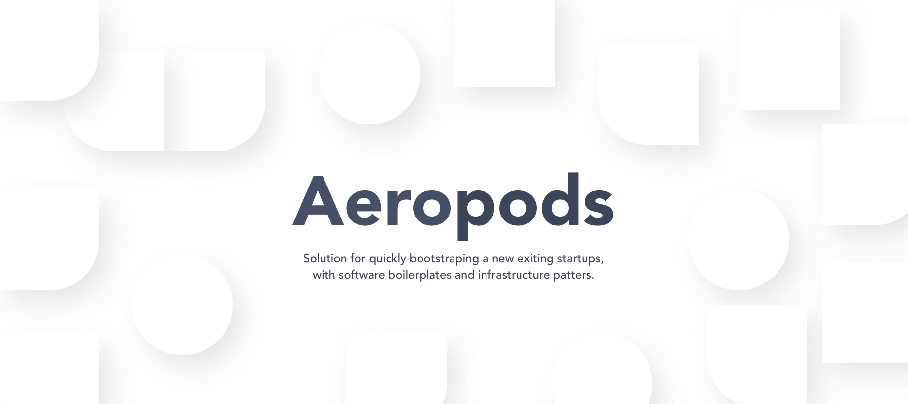

Aeropods is a collection of common boilerplates that aims to simplify your
process of building next application based on React.js or Node.js. There are
out-of-box configuration for Webpack, Docker and Kubernetes.

## What is contained in `aeropods` project?

Aeropods project stands for boilerplate for building a new applications, we're
still thinking which sample application will be a optimal option that will allow
to introduce edits and customized boilerplate for needs of your project.

## Contributing

The main purpose of this repository is to continue to evolve advanced boilerplate of new applications, making it faster and easier to use. Development of Aeropods happens in the open on GitHub, and we are grateful to the community for contributing bugfixes and improvements. Read below to learn how you can take part in improving Aeropods.

### [Code of Conduct](./CODE_OF_CONDUCT.md)

ARACLX Corp. has adopted a Code of Conduct that we expect project participants to adhere. Please read it so that you can understand what actions will and will not be tolerated.

- [ ] Contributing Guide

## License

Read [Aeropods license](./LICENSE), and [3rd-party Software Licenses](https://app.fossa.com/attribution/7f1c3528-6cf8-4d0a-a994-19879446656a) that are used by Aeropods.

| Aeropods are distributed under [MIT License](./LICENSE). |  |
| :------------------------------------------------------- | :--------------------------------------------------------------------------------------------------------------------------------------------------------------------------------------------- |

